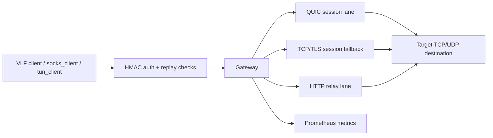

# Architecture

This repository contains the VLF Runtime Gateway, relay/session protocol implementation and thin client tools.

A formal independent third-party security audit has not yet been completed.

## Purpose

The gateway provides authenticated relay transport for VLF clients through multiple lanes:

- HTTP relay for polling-style TCP/web traffic.
- QUIC session transport with control stream, TCP streams and UDP datagrams.
- TCP/TLS session fallback when UDP/QUIC is blocked.

## Main Components

- `cmd/gateway`: gateway binary.
- `cmd/socks_client`: local SOCKS5 client that tunnels through the session client stack.
- `cmd/tun_client`: local TUN client experiment.
- `internal/relay`: HTTP relay API.
- `internal/session`: session protocol, frame handling, flow lifecycle and TCP fallback.
- `internal/sessionclient`: client transport selection and session dialing.
- `internal/auth`: HMAC auth and replay protection.
- `internal/limits`: rate, packet and flow limits.
- `internal/store`: in-memory state and TTL handling.
- `internal/metrics`: Prometheus metrics.
- `scripts/`: installer, update/uninstall, smoke tests and benchmarks.

## Data Flow

## Session Lifecycle

1. Client chooses QUIC, TCP session or relay fallback based on config and network conditions.
2. Client authenticates with client ID, timestamp, nonce and HMAC signature.
3. Gateway verifies secret, clock skew and replay cache.
4. Gateway registers the session and opens TCP/UDP flows on request.
5. Limits are applied to sessions, flows, bytes and packets.
6. Sessions and relay records expire through runtime TTL/state cleanup.

## Security Boundaries

- Client secrets are high-value authentication material.
- Gateway public transport ports are untrusted network boundaries.
- Replay cache and session store are trusted runtime state.
- Metrics endpoints should be restricted to trusted networks.
- Installer-created TLS key material is host-local secret material.

## Build and Runtime

The repository builds Go binaries and supports Docker Compose and Ubuntu systemd installation. The installer writes `/etc/vlf-proto` config, TLS material and a hardened `vlf-gateway.service`.

## Known Limitations

- Formal external audit is not completed yet.
- Replay protection and session limits depend on in-memory state unless deployment adds external coordination.
- Operational logging/metrics retention is deployment-specific.
- Volumetric DDoS resistance is outside this repository's application logic.
